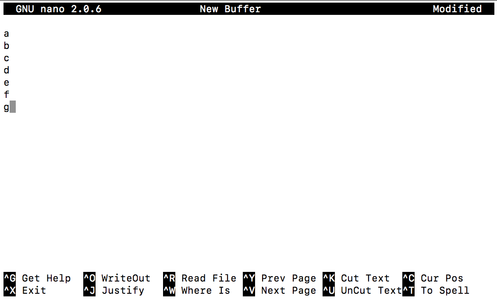

## Welcome To My Tutorial!

When I started my graduate school journey, I had no previous experience coding with any programming language. In order to complete my microbiome-related thesis, I really needed to learn how all this crazy text works. After lots of effort, I was able to teach myself how to master the basics and allowed myself to use any bioinformatic software I thought useful. With this page, I will share some insights on how to use basic command line functions, particularly focusing on teaching skills that will assist in bioinformatic research. 

I will mostly cover Unix basics, R and R Studio, Python (in particular, BioPython), and some examples running some common bioinformatic software for each programming language. Hopefully I can share some useful tips and tricks that I wished I knew when started my bioinformatic journey! 

## Why Should You Learn This?

While it is true that there are plenty of graphical user interfaces (GUIs) and websites that can complete various bioinformatic tasks for you, learning how to use these programs on the command line can take your research to the next level. 

Using command line based programs instead of GUIs will:
- give you access to more software, providing you with significantly more options for data generation and analysis
- allow you to run analysis on a larger scale, in a more rapid, efficient, and reproducible fashion
- provide you with the option to run your analysis on high performance compute clusters, or cloud servers, to free up your computer's RAM for other tasks
- enlighten you with the satisfaction of troubleshooting coding errors  

## Command Line/Unix Basics

Luckily, the basics of Unix is extremely easy to get comfortable with after some practice! There's very little to learn until you can start running some programs for your analysis.

First, we need to access a Bash Shell (Bash = Unix command language; Shell = command line interface). For mac and linux users, all you need to do is open the terminal application and you're good to go! Windows users need to download an application (many different versions exist) to access a Bash Shell.

What you'll first see when opening the command line is a prompt similar to `usr$` that usually corresponds to whatever your login username is on your computer. This prompt will change based on the directory you are in, which we will discuss in the next section!

### Directories and files 

The way your files are organized in the command line interface is exactly the same as they would be in 'Finder' or 'My Documents', just the way you access them is different. What you would normally experience in the GUI is a physical appearance of a folder, but for the command line, we call folders 'directories'. When we opened the command line, we started in our home directory. 

One of the most important concepts to understand is the *absolute file path* of a directory or file. It is as the name suggests - a path to get to your directory of interest. Use the `pwd` command (stands for 'print working directory') to see the absolute file path of the current directory.

```
username$ pwd
/Users/username
# username is our home directory, remember this!
```

For many command line programs and R, you will need to specify the absolute file path for your files that you're interested in analyzing.

Now lets get comfortable with directories and filepaths by doing a small exercise. We will create a new directory with `mkdir` and then go into that directory and display the absolute file path. Note: 'spaces' in files and directories complicate things slightly, so it's best practice to just avoid them and use an underscore instead. 


```
username$ mkdir new_directory # creates a new directory called 'new_directory'
username$ cd new_directory # changes our current directory to 'new_directory'  
```

It is important to mention that we can only call 'new_directory' like this (with `cd`) if it is located in our current directory, or else we'd have to specify the absolute file path of 'new_directory'. When you aren't specifying the full absolute file path, it means we are using a relative file path that starts from our current directory.


Now we'll explore our new directory. 

```
username$ ls # lists files in current directory

# it is blank which means there are no files in here, lets make one 
username$ nano
```

Welcome to nano, a basic text editor accessible in the command line. 



This functions like any other basic text editor, except you can only use your keyboard, so no cursor to move your way around the document! 
Make a document similar the one shown in the picture and we'll go through a few commands to explore the text file we made. Hint: ^ = the control button on your keyboard and WriteOut is the save function.

There are a few functions to quickly visualize contents of a file. We'll run through a few of them below to see how they work.

```
username$ head doc.txt
a
b
c
d
e
f
g
h
i
j

username$ tail doc.txt
g
h
i
j
k
l
m
n
o
p

username$ cat doc.txt
a
b
c
d
e
f
g
h
i
j
k
l
m
n
o
p

username$ grep "b" doc.txt
b
username$ grep -c "b" doc.txt # to count the number of lines instead of displaying the lines
1
```

These commands are simple, but are used so universely to explore files quickly. `head` prints the first ten lines, `tail` prints the last ten lines, while `cat` prints every line in a file. Rapid checks of output files from certain analyses are best done with `head` or `tail`. To search for patterns in your text file, `grep` is the go-to for Unix. It returns every line in your text file that matches the specified pattern. 

For every single command, e.g. `ls`, there will be additional arguments that you can specify, like I did with `grep -c`. These give additional functions and will be discussed later on in the tutorial for other commands. 

Tip: for those of you who are working with large files containing many sequences in FASTA format, you can use `grep -c ">" file_name` to count the number of sequences!

You can also use `nano file_name` to edit any text file that already exists. 

Now lets learn how to organize our files. We can rename and move files with `mv`, copy files with `cp`, and we'll eventually delete the file and directory.

```
# first we'll rename the file 
username$ mv doc.txt alphabet.txt
username$ ls # to see our renamed file
alphabet.txt
username$ cp alphabet.txt /Users/username # copying the file to our home directory
username$ rm alphabet.txt # to delete the file in our current directory
username$ ls # to see the file is removed

username$ cd ~ # change back into our home directory, ~ represents the home directory and is a great shortcut!
username$ rmdir new_directory # to remove a directory, it must be empty to do this however
```

Congratulations! These are the very basic commands of a Unix-based command line. The best advice I can give is to practice with these, and get comfortable with the organization and structure of the command line interface. I've found it easiest when starting out to think of directories as folders instead! Once you're confident with these easy functions, start exploring extra arguments for them like I showed with `grep` earlier if you're curious!

*Unix command cheat sheet:*

Command | Function
------- | -------
pwd | displays the current directory
mkdir | creates a new directory
cd | change directory ('~' represents home directory; '..' is the parent directory)
ls | lists all files in the directory
nano | opens up the nano text editor
head | displays the first ten lines of a file
tail | displays the last ten lines of a file
cat | displays all the text in a file
grep | searches for patterns in a file 
mv | can be used to move files to new directories and rename files
cp | copies files to a new directory
rm | deletes a file
rmdir | deletes an empty directory


